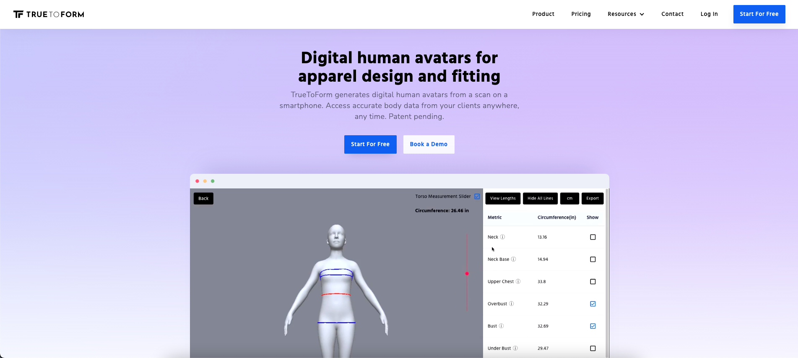
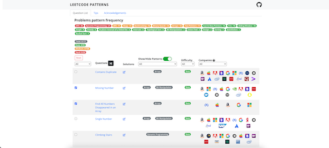

<h3 align="center">Hey!👋 I'm Leo Stepanewk</h3>

  <a href="https://www.linkedin.com/in/leo-stepanewk/">LinkedIn</a> •
  <a href="https://leostepanewk.com/resume.pdf">Resume</a> •
  <a href="https://leostepanewk.com/">Website</a>

---

I'm a sophomore at Princeton University studying computer science with minors in machine learning, finance, and entrepreneurship. As an aspiring founder, I strive to develop solutions at the intersection of cutting-edge technology and human needs.

#### CURRENTLY
- 🎓 Student at Princeton University (COS '25)
- 🍃 App & UI/UX Developer at [Boreas](https://boreas.eco/)
- 💻 COS 226/217 lab teaching assistant
- 🏗️ Building [Today @ Princeton](https://chrome.google.com/webstore/detail/today-princeton/iejdjhiphonjpgaobmpniifeipiomgee) and [TigerMap](https://cos333tigermap.herokuapp.com/)

#### BIO
- 📊 Machine learning intern at [Coinfeeds (YC S21)](https://www.coinfeeds.io/) - Spring 2023
- 🛠️ Former Co-Director of Development at [Princeton ResInDe](https://www.princetonresinde.com/)
- 👨‍💻 Second largest contributor to [Leetcode Patterns](https://seanprashad.com/leetcode-patterns/), a popular coding interview prep website
- 🖥️ Software engineering intern at [TrueToForm](https://www.truetoform.fit/) - Summer 2022
- 🔬 Independent research student at the [NYU AI4CE lab](https://ai4ce.github.io/) for 3 years
- 🏆 Member of the champion team in the 2021 MathWorks Math Modeling Challenge ([paper](https://m3challenge.siam.org/sites/default/files/uploads/CHAMPION_14817.pdf))
- 📐 Alumnus of the NJ Governor's School of Engineering and Technology ([paper](https://ieeexplore.ieee.org/document/9668909))
- 🐯 Won the $1000 “Best TigerApp” prize at HackPrinceton Spring 2022 ([devpost](https://devpost.com/software/tigermap))

#### SHOWCASE
| [TigerMap](https://cos333tigermap.herokuapp.com/)  | [TrueToForm](https://www.truetoform.fit/) |
| ------------- | ------------- |
|   |   |

| [Leetcode Patterns](https://seanprashad.com/leetcode-patterns/)  | [Today @ Princeton](https://chrome.google.com/webstore/detail/today-princeton/iejdjhiphonjpgaobmpniifeipiomgee) |
| ------------- | ------------- |
|   |   |

#### STATS

  
  

